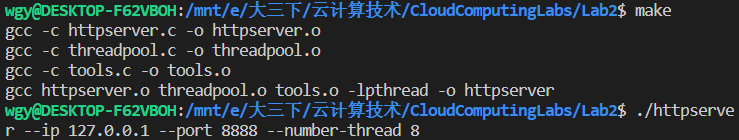
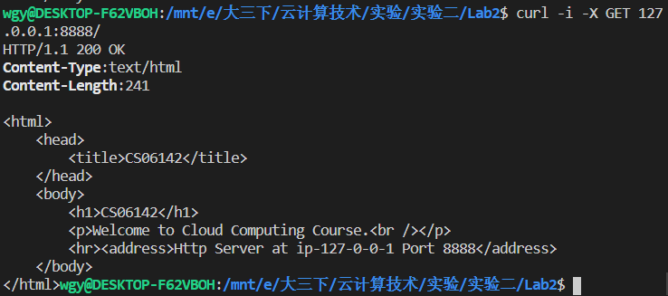
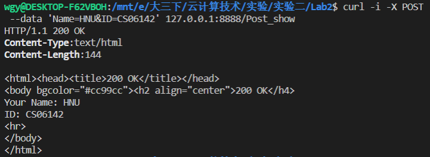
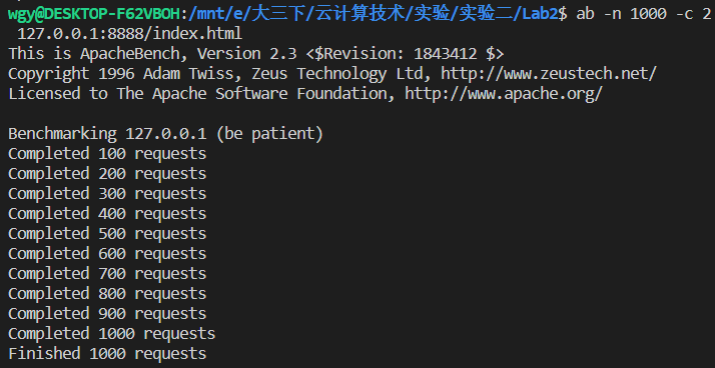
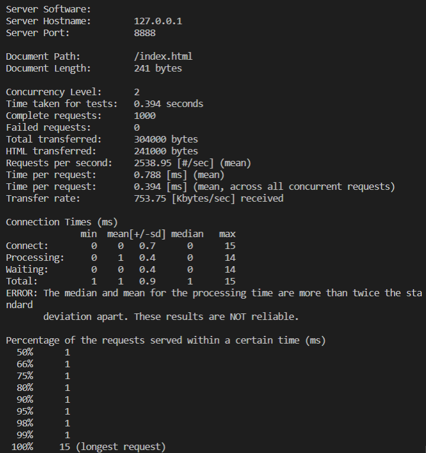

# 实验二 性能测试报告

### 一、实验简介

实现自己的HTTP服务器，从网络的角度来看，你的HTTP服务器应该实现以下功能: 

1. 创建侦听套接字并将其绑定到端口  

2. 等待客户端连接到该端口  

3. 接受客户端并获得一个新的连接套接字 

4. 读入并解析HTTP请求 

5. 开始交付服务

   * 处理HTTP GET/POST请求，如果出现错误返回错误消息。

   * 将请求代理到另一个 HTTP服务器(高级版本可选)。

在基本版本中，每个TCP连接在同一时间只有一个请求。客户机等待响应，当它得到响应时，可能会为 新请求重用TCP连接(或使用新的TCP连接)。这也是普通HTTP服务器所支持的。

### 二、实验环境

**ENV 1:** linux 内核版本为 4.4.0-18362-Microsoft；16GB 内存；CPU 型号为 Intel(R) Core(TM) i7-8750H CPU @ 2.20GHz，共有  1个物理 CPU，有 6 个物理核心，使用超线程技术，具有 12 个逻辑核心。

### 三、测试过程

make并允许服务器程序，IP 为 127.0.0.1，监听端口为 8888，线程数为 8。

通过 CURL 使用 GET 请求获取根目录页面。

通过 CURL 通过POST请求postshow页面。

使用 ab 进行并发压力测试

### 四、性能测试

> 使用 ab 进行测试。

**线程数量与每秒请求数量关系图（ENV 1环境，客户数量为10，总请求数量为1000）**

**分析：** 

​	随着线程数量的增加，单线程每秒处理的请求有限，当进行多线程处理的时候，每秒请求有所增长，但因为IO问题，到达3线程后，每秒处理的请求数量在一个稳定的范围内。

​	多线程并发处理确实可以提升服务器的处理性能，但同时，其他地方如IO，网络等问题可能会限制处理性能的进一步提升。

**客户数量与每秒请求数量关系（ENV 1环境，线程数量为4，总请求数量为1000）**

**分析：**

​	通过图标可以看出，在客户数量 2 到 4 时是翻倍的增长，符合每秒请求的增长曲线。当到达 5 以后时，每秒请求数量符合在一定的范围内。

​	在 客户数量 1 到 2 的时候，没有翻倍增长，经过讨论，我们认为是因为在一个客户数量的时候，由于处理速度过快，在 1 秒之内完成了处理，从而导致测试软件计算时，进行了补全式的计算。从而导致了没有翻倍的增长。