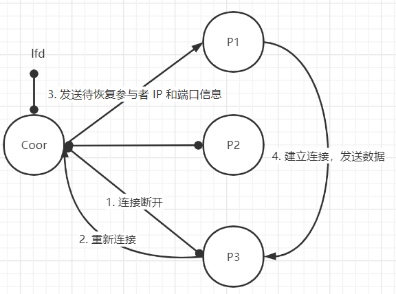

# 实验三

### 文件说明

* kvstore2pcsystem.cpp

  选择参与者和协调者

* conf.cpp

  用于解析配置文件

* coordinator.cpp

  设置协调者类，实现协调者处理逻辑

* participant.cpp

  设置参与者类，实现协调者处理逻辑

* tools.cpp

  处理ip转换等函数

* clint.cpp

  本地测试客户端

### 处理流程

#### 启动

* **P：参与者**

  参与者启动后，不断尝试与协调者进行连接

* **Coor：协调者**

  协调者启动后，开始监听配置文件里的IP和端口号。当 n 个参与者都与协调者连接成功后，参与者与协调者的连接建立完成。参与者连接成功后，从每个参与者中获取一个版本号，若当前最大的版本号不为0，那么对于版本号为 0 的参与者，启动数据恢复。同时该启动流程也应用于协调者重启后，参与者的重新连接。

#### 启动完成后

- 协调者共运行 n+2 个监听线程，其中 n 个线程 receive_participant 监听 n 个参与者，1 个线程 receive_client 监听客户端请求。
- 接收到请求后，将请求加入到一个工作队列 worklist 中，元素为{fd（建连文件描述符），message（请求）}
- 还有 1 个分发任务的线程 hand_out。该线程每次从 worklist 中取出一个请求，完成请求后给客户端回复并关闭连接。

​	

#### 处理请求

##### GET请求

​	协调者选择第一个正在运行的参与者（**这里可以使用负载方法**），发送GET请求，如果超时，则寻找下一个参与者。

##### SET / DEL请求

1. 协调者向每个参与者发送 SET / DEL 请求

   

   

2. 参与者收到 SET / DEL 请求，保存原来的数据，然后执行收到的请求，并向协调者回复 done

   

3. 参与者等待协调者指令

   * 所有参与者确认，协调者回复 commit 指令，参与者收到 commit 指令，修改成功。

   * 有参与者未确认，协调者回复 rollback 指令，参与者用原来的数据替换当前数据，修改失败。

     （这种情况发生的原因是，在修改过程中有参与者断线，但是不确定是永久断线还是暂时的网络延迟）

   

#### 参与者断线重连

​	当 n 个监听参与者的线程检测到参与者关闭，启动重连-恢复过程：

​	持续监听 lfd ：

* 若监听到的为普通用户请求，则丢弃或将请求加入 worklist 

* 若监听到的为参与者重连
  1. 停止 hand_out 线程
  2. 寻找正在运行的参与者（P1），发送 recover_send 包和待恢复参与者的 IP 和 port，表示该节点为数据提供方
  3. 给待恢复的参与者（P3）发一个 recover_recv 包，表示该节点为数据恢复方
  4. 正在运行的参与者（P1）向待恢复的参与者（P3）发起连接，并发送数据
  5. 传输完成，断开连接，恢复完成。重新运作 hand_out 线程

